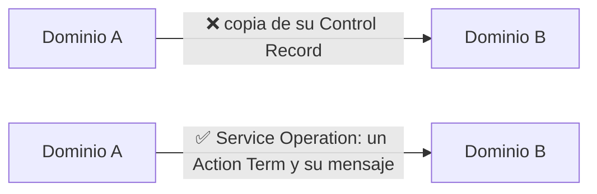
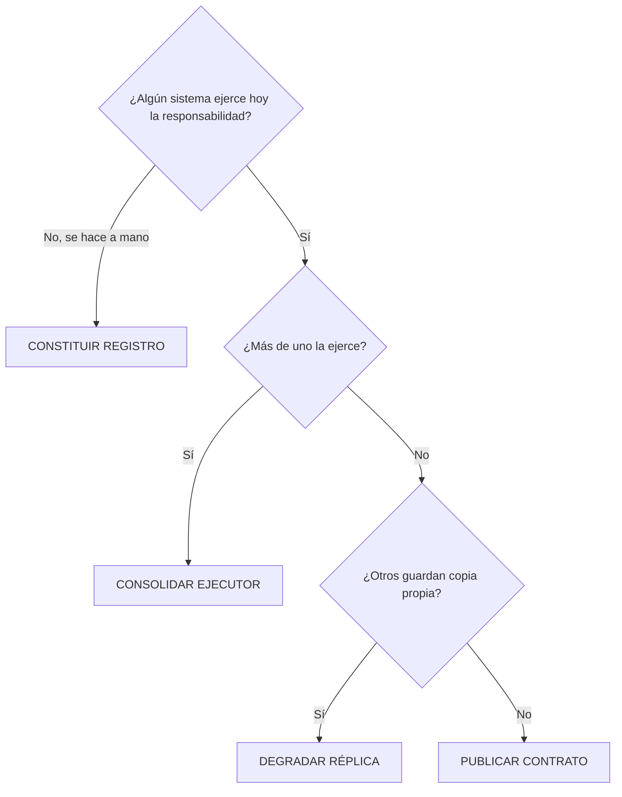

# 7. Arquitectura de datos OBJETIVO — Banco Horizonte

**Qué se hace con cada dato, quién queda como dueño y qué contrato reemplaza a cada integración.**

Este documento es la respuesta al anterior. El documento 6 dice qué está mal; éste dice qué se hace.

> Curso independiente de CPS Tech · No afiliado ni acreditado por BIAN e.V. · BIAN® es marca registrada de BIAN e.V., usada con fines descriptivos.

---

## En una página

Sobre los **6 procesos priorizados** de Banco Horizonte derivamos **31 Service Domains**. Cada uno gobierna **un** Control Record. Eso da 31 datos con nombre y apellido, y **37 entregas** entre ellos.

| Lo que encontramos | Lo que se hace |
|---|---|
| 17 datos sin dueño único | Se nombra un sistema de registro por cada uno |
| 34 entregas cruzan la frontera mal | Se reemplazan por una Service Operation publicada |
| 8 entregas llegan tarde para lo que el proceso necesita | Pasan a tiempo real |
| — | **25 de las 37 entregas ya tienen su contrato publicado por BIAN** |

Y todo eso cabe en **tres olas** de trabajo.

---

## 1. La única regla que hay que entender

El **Control Record** es el registro que un Service Domain gobierna. Es **suyo, y de nadie más**. Ningún otro dominio lo lee ni lo escribe.

Cuando un dominio necesita algo de otro, **no le pide el registro: le pide una operación**.

Es la misma idea que Domain-Driven Design aplica entre *bounded contexts*: **se intercambian mensajes, no entidades**. BIAN llega a lo mismo por otro camino y además publica el mensaje.

> **La consecuencia práctica, y es la que más cuesta aceptar:** el acoplamiento **no depende del transporte**. Un servicio REST que entrega la tabla completa acopla igual que un archivo plano con la misma tabla. El transporte cambia lo rápido que llega el dato; no cambia quién queda atado a quién.

---

## 2. Cuatro preguntas para decidir el dueño de un dato

El remedio **no se elige: se deduce**. Con tres preguntas sobre la situación actual se llega siempre a uno de cuatro patrones.

| Patrón | En una frase | Ejemplo de Banco Horizonte | Cuántos |
|---|---|---|---:|
| **CONSOLIDAR EJECUTOR** | Uno se queda con el trabajo; los demás lo llaman | El cliente se registra en el portal **y** en el core → se queda el core | 9 |
| **CONSTITUIR REGISTRO** | No existe el registro: hay que crearlo | El contrato con el agente corresponsal se firma y se archiva en papel | 6 |
| **DEGRADAR RÉPLICA** | La copia pasa a ser solo lectura | Cuatro sistemas guardan su propia copia del movimiento liquidado | 2 |
| **PUBLICAR CONTRATO** | Ya está bien: falta hacerlo alcanzable | El scoring es el único que califica; nadie más lo hace | 14 |

> **De los cuatro, solo CONSTITUIR REGISTRO cuesta dinero nuevo.** Los otros tres son reordenamiento: elegir, apagar, publicar.

---

## 3. Seis situaciones en la frontera, de la peor a la mejor

Mismo criterio para las entregas entre dominios. La pregunta es siempre **qué cruza**.

| Qué cruza hoy | Cómo se reconoce | Qué se hace | Cuántas |
|---|---|---|---:|
| 🟥 **Estado compartido** | Las dos actividades corren sobre las mismas tablas. No hay interfaz porque no hay frontera | **INTERPONER CONTRATO** — hay que crear la frontera | 10 |
| 🟥 **Dato crudo** | Un archivo o una réplica con el registro interno del otro | **SUSTITUIR VOLCADO** — el archivo se cambia por la operación | 9 |
| 🟪 **Sin soporte** | La dependencia existe y no hay ninguna interfaz declarada | **DECLARAR Y CONTRATAR** — primero se declara | 1 |
| 🟧 **Traslado manual** | Una persona copia el dato de un sistema a otro | **AUTOMATIZAR CONTRA CONTRATO** | 15 |
| 🟦 **Contrato propietario** | Hay servicio, pero hecho a medida para ese par | **MIGRAR A SEMANTIC API** | 1 |
| 🟩 **Contrato semántico** | Una Service Operation sobre un estándar | **MANTENER Y EXTENDER** — es el modelo a seguir | 1 |

### Por qué «estado compartido» es lo peor y no lo mejor

Es lo más contraintuitivo del análisis, y conviene explicarlo despacio.

Un archivo plano **se ve**: está en el inventario de interfaces, alguien lo programó, se puede medir y se puede reemplazar. Dos responsabilidades que viven en el mismo esquema **no se ven**: no aparecen en ningún inventario, nadie las programó como integración, y la dependencia es total — cualquier cambio de tabla afecta a las dos.

Coloquialmente esto se llama **integración por base de datos**, y en su forma extrema, **base de datos compartida**. El inventario del banco lo declara sin rodeos sobre el core SIGEB: *sin capa de servicios; la integración es por archivos y accesos directos a base de datos*.

Es la razón directa de que cada cambio exija regresión completa.

---

## 4. Tres casos, contados de principio a fin

Con estos tres se entiende todo el documento. Los otros 28 datos y 34 entregas siguen el mismo patrón.

### Caso 1 · El cliente que se registra dos veces

**Qué se ve hoy.** El asesor captura al cliente en el portal de vinculación. Después el mismo cliente se vuelve a registrar en el core. Después alguien lo replica a mano al CRM. Y además el motor PLAFT y el datawarehouse guardan su propia copia.

**Cinco sistemas mantienen datos del cliente y ninguno es el autorizado.**

**Por qué pasa.** No es descuido: es que nadie declaró cuál manda. Cuando no hay un registro autorizado, cada sistema que necesita el dato se lo guarda.

**Qué dice BIAN.** El dato de referencia de la parte tiene un dueño y uno solo: el Service Domain `Party Reference Data Directory`, que gobierna el Control Record `Party Reference Data Directory Entry`. Ese dominio publica **17 operaciones inbound** y emite **10 eventos outbound**. Todo lo que los otros necesitan está ahí.

**Qué se hace.** APP-01 queda como único ejecutor. APP-05 deja de ejercer el patrón y pasa a invocar sus 17 operaciones inbound.

**Qué se apaga.** APP-05, APP-04, APP-13, APP-14 dejan de mantener el registro.

**Cómo se sabe que funcionó.** Desaparecen dos actividades del proceso: `PN-01.5 Registro del cliente en el core` y `PN-01.6 Replicación del cliente al CRM`. Las dos son brechas hoy — actividades que no ejercen ninguna responsabilidad de negocio, que existen solo porque hay dos sistemas de registro. Si el proceso sigue teniéndolas, el cambio no se hizo.

---

### Caso 2 · La contabilidad que se rehace todos los meses

**Qué se ve hoy.** El core cierra el día y genera asientos. El ERP también lleva asientos. El datawarehouse extrae de los dos. Y en el cierre, una persona reconstruye todo en Excel desde cinco fuentes que no cuadran.

**Por qué pasa.** El log de asientos se mantiene en dos sistemas a la vez, y el cierre no consume ninguno de los dos: los rehace.

**Qué dice BIAN.** `Financial Accounting` gobierna el Control Record `Financial Booking Log` — *Track* sobre *Financial Booking*. Se invoca desde **4 actividades en 3 procesos distintos** (PN-02.9 · PN-04.7 · PN-10.1 · PN-10.5): originación, pagos y cierre. Un solo registro, muchos puntos de uso. Eso es reutilización, no duplicación.

**Qué se hace.** APP-11 queda como único ejecutor. APP-01 deja de ejercer el patrón y pasa a invocar sus 7 operaciones inbound.

**Qué se apaga.** APP-01, APP-12, APP-14 dejan de mantener el registro.

**Cómo se sabe que funcionó.** Desaparecen `PN-10.2 Extracción de datos del core y satélites` y `PN-10.3 Consolidación manual en hojas de cálculo`. El cierre pasa a consumir el log en vez de reconstruirlo.

---

### Caso 3 · La verificación de pago que llega un día tarde

**Qué se ve hoy.** La orden de pago se valida en el core. La verificación PLAFT de la operación ocurre en el motor de cumplimiento. Entre los dos hay **archivo plano, diario**.

**El problema no es la duplicación: es que no cuadra en el tiempo.** Una comprobación previa a la liquidación no puede alimentarse del archivo de ayer.

**Las dos únicas explicaciones posibles**, y las dos son hallazgos:

1. La comprobación **no ocurre** antes de liquidar, y el proceso documentado no es el proceso real.
2. La comprobación **sí ocurre**, por un camino que nadie documentó ni gobierna.

Ésta es la fila más útil de todo el análisis frente a negocio, porque no admite una tercera respuesta.

**Qué dice BIAN.** La cadena de pagos de la V14.0 tiene cuatro eslabones y cada uno es un dominio: `Payment Order Initiation` inicia la orden, `Payment Confirmation` hace las comprobaciones previas, `Payment Orchestration` enruta, y `Payment Settlement` mueve los fondos. La ficha de `Payment Orchestration` **declara** que invoca a los otros: la dependencia es por diseño y es legítima.

**Qué se hace.** El archivo diario se reemplaza por la invocación en línea. Se corrige el mecanismo, no la dependencia.

**Qué se apaga.** El archivo plano diario del core al motor PLAFT deja de ser la vía de esta entrega.

**Cómo se sabe que funcionó.** La comprobación ocurre dentro de la misma transacción de pago, y su resultado condiciona la liquidación. Hoy no puede hacerlo.

> **Nota de alcance honesta.** `Payment Confirmation` es uno de los cuatro dominios cuya Semantic API está en elaboración en la V14.0. Para éste, el contrato se define sobre el texto del *Role* y la ficha del work package, no sobre un Action Term ya publicado. Los otros 25 contratos de este documento sí salen del catálogo publicado.

---

## 5. La hoja de ruta, en tres olas

El orden **no sale de la gravedad** sino de cuánto se desbloquea con cada movimiento.

| Ola | Tema | Datos | Entregas | Qué cierra del caso |
|---|---|---:|---:|---|
| **OLA 1** | Fundación del dato | 3 | 12 | H-02 datos dispersos · H-07 reportes que no cuadran |
| **OLA 2** | Contratos de las cadenas críticas | 8 | 8 | H-04 procesamiento nocturno · H-08 integraciones frágiles |
| **OLA 3** | Capacidades por constituir y publicación | 20 | 17 | H-05 condiciones embebidas · H-11 datos no explotables |
| | | **31** | **37** | |

**OLA 1 · Fundación del dato.** Tres Control Records: `Party Reference Data Directory Entry`, `Financial Booking Log` y `Payment Settlement Details`. Son los tres que sostienen las cuatro brechas de la derivación. Resolverlos hace desaparecer las cuatro actividades que hoy no tienen responsabilidad de negocio. Es el movimiento que más desbloquea por unidad de esfuerzo — son los casos 1 y 2 de arriba.

**OLA 2 · Contratos de las cadenas críticas.** Originación de crédito y ejecución de pagos. Se elige esta ola en segundo lugar por una razón práctica: **en pagos ya hay una pata funcionando sobre ISO 20022** — la pasarela de pagos inmediatos. El argumento de que el estándar funciona ya está probado dentro de casa, y eso acorta a la mitad la discusión de arranque.

**OLA 3 · Capacidades por constituir y publicación.** Los seis registros que hoy no existen —cuatro de ellos en la gestión de socios y comercios, que se resuelven con un solo sistema— más la declaración de la capacidad de adquirencia y la publicación del contrato de los dominios que ya tienen dueño único.

---

## 6. El detalle completo

Las tablas de referencia. Se despliegan al hacer clic.

<b>CONSOLIDAR EJECUTOR</b> · 9 Control Records

| Ola | Control Record | Dónde se ejerce | Sistema de registro objetivo | Qué se hace | Qué deja de hacerse |
|---|---|---|---|---|---|
| OLA 1 | `Financial Booking Log` | PN-02.9 · PN-04.7 · PN-10.1 · PN-10.5 | APP-11 Contabilidad / ERP | APP-11 queda como único ejecutor. APP-01 deja de ejercer el patrón y pasa a invocar sus 7 operaciones inbound. | APP-01, APP-12, APP-14 dejan de mantener el registro. |
| OLA 1 | `Party Reference Data Directory Entry` | PN-01.2a | APP-01 SIGEB — Core Bancario | APP-01 queda como único ejecutor. APP-05 deja de ejercer el patrón y pasa a invocar sus 17 operaciones inbound. | APP-05, APP-04, APP-13, APP-14 dejan de mantener el registro. |
| OLA 2 | `Customer Access Profile Agreement` | PN-01.7b | gestor de credenciales (capacidad por constituir) | gestor de credenciales queda como único ejecutor. APP-06 y APP-07 dejan de ejercer el patrón y pasan a invocar sus 13 operaciones inbound. | APP-06, APP-07 dejan de mantener el registro. |
| OLA 2 | `Customer Offer Procedure` | PN-02.1 · PN-02.6 | APP-02 Módulo de Créditos | APP-02 queda como único ejecutor. APP-05 deja de ejercer el patrón y pasa a invocar sus 34 operaciones inbound. | APP-05 deja de mantener el registro. |
| OLA 2 | `Document Directory Entry` | PN-01.2b · PN-02.2 | gestor documental (capacidad por constituir) | gestor documental queda como único ejecutor. APP-05 deja de ejercer el patrón y pasa a invocar sus 44 operaciones inbound. | APP-05 deja de mantener el registro. |
| OLA 2 | `Issued Device Allocation` | PN-01.7a | gestor de credenciales (capacidad por constituir) | gestor de credenciales queda como único ejecutor. APP-06 y APP-07 dejan de ejercer el patrón y pasan a invocar sus 39 operaciones inbound. | APP-06, APP-07 dejan de mantener el registro. |
| OLA 2 | `Payment Order Initiation Transaction` | PN-04.1 · PN-04.2 · PN-04.6 | APP-01 SIGEB — Core Bancario | APP-01 queda como único ejecutor. APP-06 y APP-07 dejan de ejercer el patrón y pasan a invocar sus 7 operaciones inbound. | APP-06, APP-07, APP-09 dejan de mantener el registro. |
| OLA 2 | `Regulatory Compliance Administrative Plan` | PN-10.7 · PN-10.9 | APP-12 Reportería Regulatoria (Access+Excel) | APP-12 queda como único ejecutor. APP-13 deja de ejercer el patrón y pasa a invocar sus 13 operaciones inbound. | APP-13 deja de mantener el registro. |
| OLA 2 | `Underwriting Assessment` | PN-02.4 | APP-03 Motor de Scoring Crediticio | APP-03 queda como único ejecutor y expone sus 7 operaciones inbound. La parte que hoy se resuelve a mano se automatiza contra esas operaciones. | El registro deja de completarse fuera de sistema. |

<b>CONSTITUIR REGISTRO</b> · 6 Control Records

| Ola | Control Record | Dónde se ejerce | Sistema de registro objetivo | Qué se hace | Qué deja de hacerse |
|---|---|---|---|---|---|
| OLA 3 | `Correspondence Operating Session` | PN-01.8a | gestor de comunicaciones (capacidad por constituir) | Se constituye el registro en gestor de comunicaciones (capacidad por constituir), con los 4 atributos publicados del Control Record. | La responsabilidad deja de ejercerse a mano y sin evidencia. |
| OLA 3 | `Customer Agreement` | PN-01.9 | APP-01 SIGEB — Core Bancario | Se constituye el registro en APP-01 SIGEB — Core Bancario, con los 9 atributos publicados del Control Record. | APP-01, APP-02 dejan de mantener copia propia mientras no exista el registro. |
| OLA 3 | `Merchant Relationship Agreement` | PN-12.3 | gestor de alianzas (capacidad por constituir) | Se constituye el registro en gestor de alianzas (capacidad por constituir), con los 19 atributos publicados del Control Record. | La responsabilidad deja de ejercerse a mano y sin evidencia. |
| OLA 3 | `Partner Administrative Plan` | PN-11.5a | gestor de alianzas (capacidad por constituir) | Se constituye el registro en gestor de alianzas (capacidad por constituir), con los 10 atributos publicados del Control Record. | La responsabilidad deja de ejercerse a mano y sin evidencia. |
| OLA 3 | `Partner Agreement` | PN-11.3 | gestor de alianzas (capacidad por constituir) | Se constituye el registro en gestor de alianzas (capacidad por constituir), con los 6 atributos publicados del Control Record. | La responsabilidad deja de ejercerse a mano y sin evidencia. |
| OLA 3 | `Product Training Procedure` | PN-11.5b | gestor de alianzas (capacidad por constituir) | Se constituye el registro en gestor de alianzas (capacidad por constituir), con los 20 atributos publicados del Control Record. | La responsabilidad deja de ejercerse a mano y sin evidencia. |

<b>DEGRADAR REPLICA</b> · 2 Control Records

| Ola | Control Record | Dónde se ejerce | Sistema de registro objetivo | Qué se hace | Qué deja de hacerse |
|---|---|---|---|---|---|
| OLA 1 | `Payment Settlement Details` | PN-04.5 | APP-01 SIGEB — Core Bancario | APP-01 se declara sistema de registro. Las copias pasan a proyección de solo lectura alimentada por los eventos que publique su Semantic API, hoy en elaboración en la V14.0. | APP-09, APP-11, APP-12, APP-14 dejan de mantener copia propia del dato. |
| OLA 2 | `Sales Product Agreement` | PN-02.7 | APP-02 Módulo de Créditos | APP-02 se declara sistema de registro. Las copias pasan a proyección de solo lectura alimentada por sus 8 eventos outbound. | APP-01 deja de mantener copia propia del dato. |

<b>PUBLICAR CONTRATO</b> · 14 Control Records

| Ola | Control Record | Dónde se ejerce | Sistema de registro objetivo | Qué se hace | Qué deja de hacerse |
|---|---|---|---|---|---|
| OLA 3 | `Account Reconciliation Procedure` | PN-10.4 | APP-11 Contabilidad / ERP | Se declara APP-11 Contabilidad / ERP sistema de registro autorizado del Control Record y se exponen sus 22 operaciones inbound. | Ningún otro sistema queda autorizado a mantener el dato. |
| OLA 3 | `Card POS Device Allocation` | PN-12.4 | APP-09 Plataforma de Agentes | Se declara APP-09 Plataforma de Agentes sistema de registro autorizado del Control Record y se exponen sus 11 operaciones inbound. | Ningún otro sistema queda autorizado a mantener el dato. |
| OLA 3 | `Customer Credit Rating State` | PN-02.3 | APP-03 Motor de Scoring Crediticio | Se declara APP-03 Motor de Scoring Crediticio sistema de registro autorizado del Control Record y se exponen sus 12 operaciones inbound. | Ningún otro sistema queda autorizado a mantener el dato. |
| OLA 3 | `Customer Product And Service Directory Entry` | PN-01.8b | APP-01 SIGEB — Core Bancario | Se declara APP-01 SIGEB — Core Bancario sistema de registro autorizado del Control Record y se exponen sus 19 operaciones inbound. | Ningún otro sistema queda autorizado a mantener el dato. |
| OLA 3 | `Disbursement Transaction` | PN-02.8 | APP-01 SIGEB — Core Bancario | Se declara APP-01 SIGEB — Core Bancario sistema de registro autorizado del Control Record y se exponen sus 7 operaciones inbound. | Ningún otro sistema queda autorizado a mantener el dato. |
| OLA 3 | `Financial Statements Analysis` | PN-10.6 | APP-11 Contabilidad / ERP | Se declara APP-11 Contabilidad / ERP sistema de registro autorizado del Control Record y se exponen las operaciones que publique su Semantic API, hoy en elaboración en la V14.0. | Ningún otro sistema queda autorizado a mantener el dato. |
| OLA 3 | `Lead and Opportunity Procedure` | PN-11.1 · PN-12.1 | APP-04 CRM Comercial | Se declara APP-04 CRM Comercial sistema de registro autorizado del Control Record y se exponen sus 10 operaciones inbound. | Ningún otro sistema queda autorizado a mantener el dato. |
| OLA 3 | `Merchant Acquiring Facility` | PN-12.5 | APP-09 Plataforma de Agentes | Se declara APP-09 Plataforma de Agentes sistema de registro autorizado del Control Record y se exponen sus 19 operaciones inbound. | Ningún otro sistema queda autorizado a mantener el dato. |
| OLA 3 | `Partner Event Log` | PN-11.6 | APP-09 Plataforma de Agentes | Se declara APP-09 Plataforma de Agentes sistema de registro autorizado del Control Record y se exponen las operaciones que publique su Semantic API, hoy en elaboración en la V14.0. | Ningún otro sistema queda autorizado a mantener el dato. |
| OLA 3 | `Party Relationship Administrative Plan` | PN-01.1 · PN-01.3 | APP-05 Portal de Vinculación | Se declara APP-05 Portal de Vinculación sistema de registro autorizado del Control Record y se exponen sus 15 operaciones inbound. | Ningún otro sistema queda autorizado a mantener el dato. |
| OLA 3 | `Payment Confirmation Details` | PN-04.3 | APP-13 Monitoreo PLAFT | Se declara APP-13 Monitoreo PLAFT sistema de registro autorizado del Control Record y se exponen las operaciones que publique su Semantic API, hoy en elaboración en la V14.0. | Ningún otro sistema queda autorizado a mantener el dato. |
| OLA 3 | `Payment Orchestration Details` | PN-04.4 | APP-10 Pasarela de Pagos Inmediatos | Se declara APP-10 Pasarela de Pagos Inmediatos sistema de registro autorizado del Control Record y se exponen las operaciones que publique su Semantic API, hoy en elaboración en la V14.0. | Ningún otro sistema queda autorizado a mantener el dato. |
| OLA 3 | `Point of Service Operating Session` | PN-11.4 | APP-09 Plataforma de Agentes | Se declara APP-09 Plataforma de Agentes sistema de registro autorizado del Control Record y se exponen sus 23 operaciones inbound. | Ningún otro sistema queda autorizado a mantener el dato. |
| OLA 3 | `Regulatory Compliance Assessment` | PN-01.4 · PN-11.2 · PN-12.2 | APP-13 Monitoreo PLAFT | Se declara APP-13 Monitoreo PLAFT sistema de registro autorizado del Control Record y se exponen sus 5 operaciones inbound. | Ningún otro sistema queda autorizado a mantener el dato. |

<b>INTERPONER CONTRATO</b> · 10 entregas

| Ola | Entrega entre actividades | Dominio origen → destino | Contrato objetivo | Efecto |
|---|---|---|---|---|
| OLA 1 | **PN-01** Vinculacion de clientes PN-01.1 Recepcion de la solicitud → PN-01.2a Captura de datos de la parte | Party Lifecycle Management → Party Reference Data Directory | Party Reference Data Directory  ←  Update / Retrieve  sobre  Reference | Aparece una frontera donde hoy no hay ninguna: Party Reference Data Directory deja de leer las tablas de Party Lifecycle Management. |
| OLA 1 | **PN-01** Vinculacion de clientes PN-01.2a Captura de datos de la parte → PN-01.2b Captura de documentos | Party Reference Data Directory → Document Directory | Document Directory  ←  Execute / Notify / Register / Request  sobre  Document Reference Properties | Aparece una frontera donde hoy no hay ninguna: Document Directory deja de leer las tablas de Party Reference Data Directory. |
| OLA 1 | **PN-10** Cierre contable y reporteria PN-10.3 Consolidacion manual en hojas de calculo → PN-10.4 Conciliacion entre contabilidad y operaciones | (brecha PN-10.3) → Account Reconciliation | Account Reconciliation  ←  Exchange / Initiate / Request / Update  sobre  Account Assessment | Aparece una frontera donde hoy no hay ninguna: Account Reconciliation deja de leer las tablas de (brecha PN-10.3). |
| OLA 1 | **PN-10** Cierre contable y reporteria PN-10.5 Ajustes manuales y reclasificaciones → PN-10.6 Generacion de estados financieros | Financial Accounting → Financial Statements | Financial Statements  ←  contrato por definir sobre el Role del work package V14.0 | Aparece una frontera donde hoy no hay ninguna: Financial Statements deja de leer las tablas de Financial Accounting. |
| OLA 2 | **PN-02** Originacion de credito PN-02.3 Consulta a central de riesgos → PN-02.4 Suscripcion y decision de credito | Customer Credit Rating → Underwriting | Underwriting  ←  Evaluate / Update / Execute / Request  sobre  el Control Record | Aparece una frontera donde hoy no hay ninguna: Underwriting deja de leer las tablas de Customer Credit Rating. |
| OLA 2 | **PN-02** Originacion de credito PN-02.6 Definicion de condiciones (monto, plazo, tasa) → PN-02.7 Formalizacion del contrato de credito | Customer Offer → Sales Product Agreement | Sales Product Agreement  ←  Evaluate / Retrieve / Update  sobre  Legal Term | Aparece una frontera donde hoy no hay ninguna: Sales Product Agreement deja de leer las tablas de Customer Offer. |
| OLA 2 | **PN-02** Originacion de credito PN-02.7 Formalizacion del contrato de credito → PN-02.8 Desembolso | Sales Product Agreement → Disbursement | Disbursement  ←  Initiate / Update / Control / Exchange  sobre  el Control Record | Aparece una frontera donde hoy no hay ninguna: Disbursement deja de leer las tablas de Sales Product Agreement. |
| OLA 3 | **PN-01** Vinculacion de clientes PN-01.2b Captura de documentos → PN-01.3 Validacion de identidad | Document Directory → Party Lifecycle Management | Party Lifecycle Management  ←  Retrieve  sobre  Identity Proofing | Aparece una frontera donde hoy no hay ninguna: Party Lifecycle Management deja de leer las tablas de Document Directory. |
| OLA 3 | **PN-01** Vinculacion de clientes PN-01.7a Habilitacion de credenciales → PN-01.7b Habilitacion de canales | Issued Device Administration → Customer Access Entitlement | Customer Access Entitlement  ←  Evaluate / Update / Retrieve  sobre  Preferences | Aparece una frontera donde hoy no hay ninguna: Customer Access Entitlement deja de leer las tablas de Issued Device Administration. |
| OLA 3 | **PN-12** Afiliacion de comercios adquirentes PN-12.4 Instalacion y administracion de terminales POS → PN-12.5 Activacion del comercio y operacion de la cuenta | Card Terminal Administration → Merchant Acquiring Facility | Merchant Acquiring Facility  ←  Retrieve  sobre  Support Facility | Aparece una frontera donde hoy no hay ninguna: Merchant Acquiring Facility deja de leer las tablas de Card Terminal Administration. |

<b>SUSTITUIR VOLCADO</b> · 9 entregas

| Ola | Entrega entre actividades | Dominio origen → destino | Contrato objetivo | Efecto |
|---|---|---|---|---|
| OLA 1 | **PN-01** Vinculacion de clientes PN-01.6 Replicacion del cliente al CRM → PN-01.7a Habilitacion de credenciales | (brecha PN-01.6) → Issued Device Administration | Issued Device Administration  ←  Update / Control / Retrieve / Capture  sobre  Password Assignment | El Control Record de (brecha PN-01.6) deja de salir del dominio. Issued Device Administration deja de conocer su esquema interno. Elimina la contradicción de latencia: la entrega pasa de diario + en línea a en línea. **⚠️ además elimina un retraso que el proceso no tolera** |
| OLA 1 | **PN-02** Originacion de credito PN-02.8 Desembolso → PN-02.9 Registro contable del desembolso | Disbursement → Financial Accounting | Financial Accounting  ←  Capture / Retrieve / Update  sobre  Ledger Posting | El Control Record de Disbursement deja de salir del dominio. Financial Accounting deja de conocer su esquema interno. Elimina la contradicción de latencia: la entrega pasa de diario a en línea. **⚠️ además elimina un retraso que el proceso no tolera** |
| OLA 1 | **PN-04** Ejecucion de pagos PN-04.6 Confirmacion al cliente → PN-04.7 Registro contable | Payment Order Initiation → Financial Accounting | Financial Accounting  ←  Capture / Retrieve / Update  sobre  Ledger Posting | El Control Record de Payment Order Initiation deja de salir del dominio. Financial Accounting deja de conocer su esquema interno. Elimina la contradicción de latencia: la entrega pasa de en línea + diario a en línea. **⚠️ además elimina un retraso que el proceso no tolera** |
| OLA 1 | **PN-10** Cierre contable y reporteria PN-10.1 Cierre de operaciones del dia → PN-10.2 Extraccion de datos del core y satelites | Financial Accounting → (brecha PN-10.2) | (brecha PN-10.2)  ←  contrato por definir sobre el Role del work package V14.0 | El Control Record de Financial Accounting deja de salir del dominio. (brecha PN-10.2) deja de conocer su esquema interno. |
| OLA 2 | **PN-04** Ejecucion de pagos PN-04.2 Validacion de la orden → PN-04.3 Verificacion PLAFT de la operacion | Payment Order Initiation → Payment Confirmation | Payment Confirmation  ←  contrato por definir sobre el Role del work package V14.0 | El Control Record de Payment Order Initiation deja de salir del dominio. Payment Confirmation deja de conocer su esquema interno. Elimina la contradicción de latencia: la entrega pasa de diario a en línea. **⚠️ además elimina un retraso que el proceso no tolera** |
| OLA 2 | **PN-04** Ejecucion de pagos PN-04.3 Verificacion PLAFT de la operacion → PN-04.4 Enrutamiento (interno / interbancario) | Payment Confirmation → Payment Orchestration | Payment Orchestration  ←  contrato por definir sobre el Role del work package V14.0 | El Control Record de Payment Confirmation deja de salir del dominio. Payment Orchestration deja de conocer su esquema interno. Elimina la contradicción de latencia: la entrega pasa de diario + en línea a en línea. **⚠️ además elimina un retraso que el proceso no tolera** |
| OLA 3 | **PN-01** Vinculacion de clientes PN-01.3 Validacion de identidad → PN-01.4 Verificacion en listas y perfil PLAFT | Party Lifecycle Management → Regulatory Compliance | Regulatory Compliance  ←  Retrieve / Evaluate / Request / Update  sobre  el Control Record | El Control Record de Party Lifecycle Management deja de salir del dominio. Regulatory Compliance deja de conocer su esquema interno. Elimina la contradicción de latencia: la entrega pasa de en línea + diario a en línea. **⚠️ además elimina un retraso que el proceso no tolera** |
| OLA 3 | **PN-11** Incorporacion de agentes corresponsales PN-11.1 Prospeccion y evaluacion del agente → PN-11.2 Evaluacion de riesgo y cumplimiento del aliado | Lead and Opportunity Management → Regulatory Compliance | Regulatory Compliance  ←  Retrieve / Evaluate / Request / Update  sobre  el Control Record | El Control Record de Lead and Opportunity Management deja de salir del dominio. Regulatory Compliance deja de conocer su esquema interno. Elimina la contradicción de latencia: la entrega pasa de diario + diario a en línea. **⚠️ además elimina un retraso que el proceso no tolera** |
| OLA 3 | **PN-12** Afiliacion de comercios adquirentes PN-12.1 Prospeccion y evaluacion del comercio → PN-12.2 Evaluacion de riesgo y cumplimiento del comercio | Lead and Opportunity Management → Regulatory Compliance | Regulatory Compliance  ←  Retrieve / Evaluate / Request / Update  sobre  el Control Record | El Control Record de Lead and Opportunity Management deja de salir del dominio. Regulatory Compliance deja de conocer su esquema interno. Elimina la contradicción de latencia: la entrega pasa de diario + diario a en línea. **⚠️ además elimina un retraso que el proceso no tolera** |

<b>DECLARAR Y CONTRATAR</b> · 1 entregas

| Ola | Entrega entre actividades | Dominio origen → destino | Contrato objetivo | Efecto |
|---|---|---|---|---|
| OLA 2 | **PN-02** Originacion de credito PN-02.4 Suscripcion y decision de credito → PN-02.6 Definicion de condiciones (monto, plazo, tasa) | Underwriting → Customer Offer | Customer Offer  ←  Update / Retrieve  sobre  Credit | La dependencia entra al inventario y deja de ser invisible. |

<b>AUTOMATIZAR CONTRA CONTRATO</b> · 15 entregas

| Ola | Entrega entre actividades | Dominio origen → destino | Contrato objetivo | Efecto |
|---|---|---|---|---|
| OLA 1 | **PN-01** Vinculacion de clientes PN-01.9 Suscripcion del contrato marco → PN-01.5 Registro del cliente en el core | Customer Agreement → (brecha PN-01.5) | (brecha PN-01.5)  ←  contrato por definir sobre el Role del work package V14.0 | La entrega deja de depender de una persona y de su interpretación del dato. |
| OLA 1 | **PN-10** Cierre contable y reporteria PN-10.4 Conciliacion entre contabilidad y operaciones → PN-10.5 Ajustes manuales y reclasificaciones | Account Reconciliation → Financial Accounting | Financial Accounting  ←  Capture / Retrieve / Update  sobre  Ledger Posting | La entrega deja de depender de una persona y de su interpretación del dato. |
| OLA 2 | **PN-02** Originacion de credito PN-02.1 Recepcion de la solicitud de credito → PN-02.2 Conformacion del expediente | Customer Offer → Document Directory | Document Directory  ←  Execute / Notify / Register / Request  sobre  Document Verification Properties | La entrega deja de depender de una persona y de su interpretación del dato. |
| OLA 2 | **PN-02** Originacion de credito PN-02.2 Conformacion del expediente → PN-02.3 Consulta a central de riesgos | Document Directory → Customer Credit Rating | Customer Credit Rating  ←  Capture / Retrieve  sobre  External Reporting | La entrega deja de depender de una persona y de su interpretación del dato. |
| OLA 3 | **PN-01** Vinculacion de clientes PN-01.4 Verificacion en listas y perfil PLAFT → PN-01.9 Suscripcion del contrato marco | Regulatory Compliance → Customer Agreement | Customer Agreement  ←  Evaluate / Update / Retrieve  sobre  Legal Term | La entrega deja de depender de una persona y de su interpretación del dato. |
| OLA 3 | **PN-01** Vinculacion de clientes PN-01.7b Habilitacion de canales → PN-01.8a Entrega de bienvenida | Customer Access Entitlement → Correspondence | Correspondence  ←  Retrieve / Initiate / Update  sobre  Outbound | La entrega deja de depender de una persona y de su interpretación del dato. |
| OLA 3 | **PN-01** Vinculacion de clientes PN-01.8a Entrega de bienvenida → PN-01.8b Activacion de productos y servicios | Correspondence → Customer Product and Service Directory | Customer Product and Service Directory  ←  Execute / Notify / Register / Request  sobre  Product | La entrega deja de depender de una persona y de su interpretación del dato. |
| OLA 3 | **PN-10** Cierre contable y reporteria PN-10.6 Generacion de estados financieros → PN-10.7 Elaboracion de reportes regulatorios (SBS y UIF) | Financial Statements → Regulatory Reporting | Regulatory Reporting  ←  Capture / Exchange / Retrieve  sobre  Authoring | La entrega deja de depender de una persona y de su interpretación del dato. |
| OLA 3 | **PN-11** Incorporacion de agentes corresponsales PN-11.2 Evaluacion de riesgo y cumplimiento del aliado → PN-11.3 Firma del contrato de corresponsalia | Regulatory Compliance → Partner Agreement | Partner Agreement  ←  Evaluate / Retrieve / Update  sobre  Legal Term | La entrega deja de depender de una persona y de su interpretación del dato. |
| OLA 3 | **PN-11** Incorporacion de agentes corresponsales PN-11.3 Firma del contrato de corresponsalia → PN-11.4 Integracion tecnica del punto de atencion | Partner Agreement → Point of Service | Point of Service  ←  Update / Control / Retrieve / Initiate  sobre  Assisted | La entrega deja de depender de una persona y de su interpretación del dato. |
| OLA 3 | **PN-11** Incorporacion de agentes corresponsales PN-11.4 Integracion tecnica del punto de atencion → PN-11.5a Habilitacion y activacion del agente | Point of Service → Partner Administration | Partner Administration  ←  contrato por definir sobre el Role del work package V14.0 | La entrega deja de depender de una persona y de su interpretación del dato. |
| OLA 3 | **PN-11** Incorporacion de agentes corresponsales PN-11.5a Habilitacion y activacion del agente → PN-11.5b Capacitacion del agente | Partner Administration → Product Training | Product Training  ←  Exchange / Execute / Initiate / Retrieve  sobre  Service Delivery | La entrega deja de depender de una persona y de su interpretación del dato. |
| OLA 3 | **PN-11** Incorporacion de agentes corresponsales PN-11.5b Capacitacion del agente → PN-11.6 Monitoreo de la operacion del agente | Product Training → Operations Log | Operations Log  ←  contrato por definir sobre el Role del work package V14.0 | La entrega deja de depender de una persona y de su interpretación del dato. |
| OLA 3 | **PN-12** Afiliacion de comercios adquirentes PN-12.2 Evaluacion de riesgo y cumplimiento del comercio → PN-12.3 Firma del contrato de afiliacion | Regulatory Compliance → Merchant Relations | Merchant Relations  ←  Notify / Retrieve / Evaluate / Exchange  sobre  Operational Term | La entrega deja de depender de una persona y de su interpretación del dato. |
| OLA 3 | **PN-12** Afiliacion de comercios adquirentes PN-12.3 Firma del contrato de afiliacion → PN-12.4 Instalacion y administracion de terminales POS | Merchant Relations → Card Terminal Administration | Card Terminal Administration  ←  Provide / Control / Exchange / Update  sobre  Allocation | La entrega deja de depender de una persona y de su interpretación del dato. |

<b>MIGRAR A SEMANTIC API</b> · 1 entregas

| Ola | Entrega entre actividades | Dominio origen → destino | Contrato objetivo | Efecto |
|---|---|---|---|---|
| OLA 1 | **PN-04** Ejecucion de pagos PN-04.5 Ejecucion del cargo y abono → PN-04.6 Confirmacion al cliente | Payment Settlement → Payment Order Initiation | Payment Order Initiation  ←  Retrieve  sobre  Confirmation | La interfaz deja de ser privada del par y queda disponible para cualquier consumidor. |

<b>MANTENER Y EXTENDER</b> · 1 entregas

| Ola | Entrega entre actividades | Dominio origen → destino | Contrato objetivo | Efecto |
|---|---|---|---|---|
| OLA 1 | **PN-04** Ejecucion de pagos PN-04.4 Enrutamiento (interno / interbancario) → PN-04.5 Ejecucion del cargo y abono | Payment Orchestration → Payment Settlement | Payment Settlement  ←  contrato por definir sobre el Role del work package V14.0 | Se conserva como patrón de referencia. |

---

## 7. Dónde está cada cosa

### Vistas en el modelo Archi

Se leen **de a pares**: el diagnóstico a la izquierda, el objetivo a la derecha. Mismas filas, mismo orden, mismas columnas de anclaje.

| Vista | Qué responde |
|---|---|
| `M5 - Arquitectura de datos · propiedad del Control Record` | ¿Quién es dueño de qué dato, y quién más lo mantiene sin serlo? |
| `M5 - Arquitectura de datos OBJETIVO · propiedad del Control Record` | ¿Qué se hace con cada dato y qué se apaga? |
| `M5 - Arquitectura de datos · acoplamiento entre dominios` | ¿Qué cruza cada frontera y cómo está establecida la dependencia? |
| `M5 - Arquitectura de datos OBJETIVO · contratos de servicio` | ¿Qué operación concreta reemplaza a cada entrega? |

Y las que sostienen el análisis:

| Vista | Aporta |
|---|---|
| `M3 - Derivacion de responsabilidades funcionales → Service Domains BIAN v14` | De qué actividad sale cada Service Domain |
| `M3 - Service Domain → Capacidad L2` | A qué capacidad de negocio sirve cada dominio |
| `M4 - Consolidacion de responsabilidades funcionales → Service Domains BIAN v14` | Por qué el catálogo quedó en 31 dominios |
| `M4 - BIAN v14 · Service Landscape (vista Matrix) · 341 Service Domains` | El catálogo oficial completo |
| `M2 - Panorama Aplicativo AS-IS (Banco Horizonte)` · `M2 - Duplicacion de Datos H-02 (Banco Horizonte)` | Los sistemas y sus copias |

Los scripts jArchi que las generan están en `model/`. Son **idempotentes**: se pueden volver a ejecutar sobre el modelo seleccionado sin duplicar elementos.

### Documentos del repositorio

| Archivo | Contenido |
|---|---|
| `docs/1. Caso-de-Negocio-Banco-Horizonte.md` | El caso y sus hallazgos H-01 a H-12 |
| `docs/2. Inventario_Procesos_Banco-Horizonte.md` | Los 11 procesos y su SIPOC extendido |
| `docs/3. Inventario_Aplicaciones_Banco-Horizonte.md` | Las 14 aplicaciones, la matriz objeto × aplicación y las 13 interfaces |
| `docs/4. Derivacion_Responsabilidades_Funcionales_BIAN_Procesos_Banco-Horizonte.md` | Cómo se derivó cada Service Domain de cada actividad |
| `docs/5. Consolidacion_Dominios_Servicio_BIAN_Procesos_Banco-Horizonte.md` | Las consolidaciones que dejaron el catálogo en 31 |
| `docs/6. Arquitectura_Datos_Banco-Horizonte.md` | **El diagnóstico**: brechas, duplicación, acoplamiento y dependencias |
| `docs/7. Arquitectura_Datos_Objetivo_Banco-Horizonte.md` | **Este documento**: el plan |
| `BIAN_v14_Matriz_341/` | El catálogo oficial de los 341 Service Domains |

---

## Para llevarse

1. **Un dato, un dueño.** Si dos sistemas lo mantienen, uno de los dos está de más.
2. **Lo que cruza la frontera es un mensaje, no un registro.** Si cruza el registro, los dos dominios quedan atados.
3. **La dependencia no es el problema; la dependencia escondida sí.** Que un dominio invoque a otro está bien y a veces está en el estándar. Que dependa de él por una tabla compartida, no.
4. **El contrato ya existe.** En 25 de las 37 entregas, la operación que hay que invocar está publicada. El trabajo es de adopción, no de diseño.
5. **Una arquitectura objetivo se mide por lo que apaga.** Construir el registro nuevo sin apagar los otros cuatro produce un quinto dueño.

---

**Fuente.** Vista Matrix del BIAN Service Landscape V14.0 y las fichas `SD Overview` y `Control Record Diagram` de cada dominio. Los ejemplos de los libros de BIAN no son fuente de nomenclatura y no entran en este análisis.